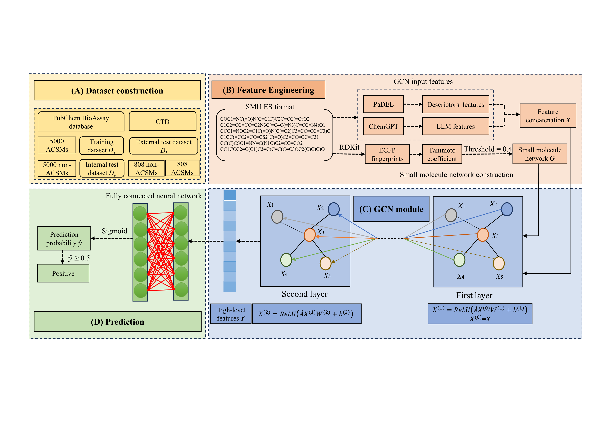

# AnticanNet
A graph neural network -based prediction model for anticancer small molecules 
# 1.Description

This repository provides the data and codes for the prediction of anti-cancer small molecules. First, relevant data are collected from the NCBI PubChem BioAssay and CTD databases to construct one training dataset and two independent test datasets.  Next,  the descriptor features and LLM featrues are extracted from the SMILES format of small molecules thorugh PaDEL and ChemGPT. At the same time, a small molecule network is constructed based on the structure similarity of small molecules. Then, a two-layer Graph Convolutional Network (GCN) is applied on above featrues and network to extract high-level features of small molecules. Finally, a fully connected neural network is used for make predictions.
# 2.Requirements
## Software Dependencies

Python >= 3.10.15

pytorch = 2.0.0

pytorch-cuda = 11.8

numpy=1.24.4

pandas=1.5.3

tensorflow=2.11.0

scikit-learn=1.2.2

matplotlib=3.7.1

spektral=1.2.0

rdkit=2022.09.5

tqdm=4.65.0

openpyxl=3.1.2
## Hardware Configuration
Operating System: Windows 10 / 11 (64-bit)

CPU: Intel Core i7-13700H

GPU: NVIDIA GeForce RTX 3060 Laptop GPU (6 GB VRAM)

Memory (RAM): 16 GB

CUDA Version: 11.8
# 3.How to run
## 3.1 Download Project Files
Open the GitHub repository page, click the Code button in the upper right corner, select Download ZIP to download the project compressed package
```
git clone https://github.com/X67-cat/GNNASM-main.git
```
Unzip the compressed package and ensure the local directory structure is complete including code files, images folder, datasets, etc.
## 3.2 Prepare Running Environment
1. Open the terminal (or VS Code terminal) and navigate to the project root directory
Install dependency packages (Python 3.7+ needs to be installed in advance)
```
pip install numpy pandas tensorflow scikit-learn spektral scipy
```
2. After the installation is complete, you can check if all libraries are successfully installed using the following command:
```
python -c "import numpy, pandas, tensorflow, sklearn, spektral, scipy; print('All dependencies are installed successfully!')"
```
If the terminal outputs "All dependencies are installed successfully!", it means the environment preparation is complete.
## 3.3 Train and Test Model (Based on Training Set)
To ensure reproducibility, random seeds were fixed before training:
```
import os, random, numpy as np, tensorflow as tf, torch

seed = 42
os.environ['PYTHONHASHSEED'] = str(seed)
random.seed(seed)
np.random.seed(seed)
tf.random.set_seed(seed)
torch.manual_seed(seed)
torch.cuda.manual_seed_all(seed)
```

Put your data into the ```GNNmodel\train_gnn.py```:
```
TRsmiles_feature.csv
TRsniles_label.csv
Tanimoto_filtered.csv
```
Code running description:
1. The code will first load and preprocess the data, including reading the above three data files, performing data merging, feature standardization, adjacency matrix construction and normalization, etc.
2. Build a GCN model, which includes two GCNConv layers, Dropout layers, Dense layers, etc., using the adam optimizer and binary_crossentropy as the loss function.
3. Use 10-fold cross-validation for training, and during the training process, the 7th fold model will be saved to 
```
models/gcn_model_fold_7.h5
```
4. After training, it will output the evaluation indicators (accuracy, sensitivity, specificity, auc, mcc, precision, f1-score) for each fold and the summary results of cross-validation (mean ± standard deviation).
## 3.4 Model Prediction (Based on Test Set) 
Put your data into the ```GNNmodel\test_gnn.py```:
```
TRsmiles_feature.csv
TRsniles_label.csv
Tanimoto_filtered.csv
```
1. The code will load the 7th fold model (models/gcn_model_fold_7.h5) saved during training, and load the above three data files and perform the same data preprocessing operations as during training.
2. Use the loaded model to predict the test set data, and obtain the prediction probability and prediction label.
3. Calculate and output the evaluation indicators (accuracy, sensitivity, specificity, auc, mcc, precision, f1-score) of the test set to evaluate the performance of the model on the test set.
# 4 Reproducibility Statement
To ensure the reproducibility of our research, we provide the following resources:
## 4.1 Code Availability
The complete source code for model training, evaluation, and inference is available at: https://github.com/X67-cat/GNNASM-main
## 4.2 Datasets
All datasets used in this study are included in the repository under the GNNASM-main/main:
   ```
TRsmiles_feature.csv
TRsniles_label.csv
Tanimoto_filtered.csv
```
The raw data sources from NCBI PubChem BioAssay and CTD databases are publicly available, and our preprocessing scripts are provided in the code repository.
## 4.3 Pretrained Models
1. We provide complete model training code. The best-performing model reported in the paper (fold 7 from 10-fold cross-validation) can be directly generated by running our provided training script (GNNmodel/train_gnn.py).
2. The model architecture, hyperparameters, and training pipeline are fully defined in the code. By setting the fixed random seed (seed=42), we ensure that identical models are generated in each training run.
3. When users execute the training script, the generated model will be automatically saved to models/gcn_model_fold_7.h5, thereby reproducing all prediction results reported in the paper.
## 4.4 Environment Configuration:
1. Complete dependency list in requirements.txt
2. Detailed hardware and software specifications provided in Section 2
3. Fixed random seeds (seed=42) ensure deterministic results
## 4.5 Step-by-Step Reproduction Guide
1. Complete instructions for data preparation, model training, and evaluation are provided in Section 3
2. The repository structure is organized to facilitate easy replication
3. All hyperparameters and model architectures are explicitly defined in the code
We have verified that following these instructions allows for training models identical to those used in our paper and complete replication of all results reported below.
# 5 Results 
In the experiments, the input files used for both the training and testing sets are the same: data/TRsmiles_feature.csv, data/TRsmiles_label.csv, and data/Tanimoto_filtered.csv. However, the code distinguishes between training and testing data by selecting the first 8,000 samples as the training set and the remaining 2,000 samples as the validation (test) set. After running the code, the results of 10-fold cross-validation on the training set and the evaluation on the test set will be displayed in the terminal for easy observation and selection of experimental results. It is recommended to back up important results in advance. If you wish to preserve historical outputs, you may modify the code accordingly.


